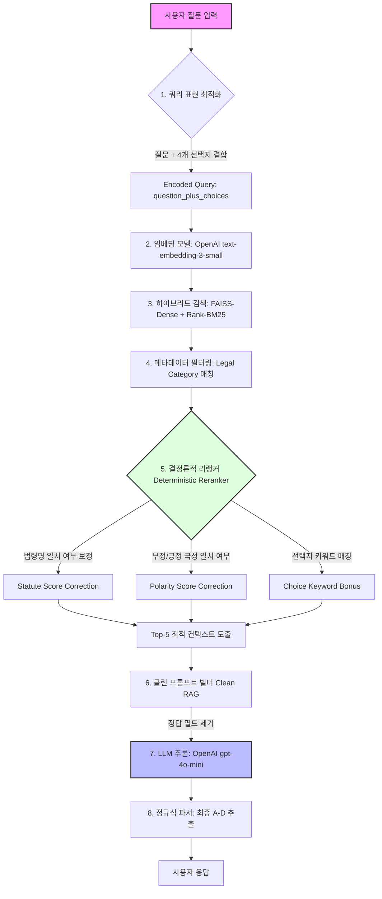

# RAG_Agent_Test

## 디렉토리 구조

```text
.
├── configs/                # 하이드라(Hydra) 기반 검색/프롬프트 전략 설정 파일
├── data/                   # 법률 학습(train) 및 평가(dev/test) 데이터셋
├── docs/                   # 1~8차 실험 보고서 및 분석 문서
├── outputs/                # 실험 결과물, 로그 및 평가 리포트
├── src/                    # 에이전트 핵심 소스 코드
│   ├── agent/             # RAG 엔진 (Retriever, PromptBuilder, Reranker 등)
│   ├── app/               # FastAPI 서버 (Controller, Router, Service)
│   ├── config/            # 전역 환경 설정 및 .env 로드
│   └── main.py            # 서버 엔트리포인트
├── test/                   # 단위 테스트 및 8차 실험용 스윕(Sweep) 스위트
├── pyproject.toml          # uv 기반 프로젝트 메타데이터 및 의존성
└── uv.lock                 # 프로젝트 환경 잠금 파일
```

## 초기 Agent System 구축 및 평가 스크립트 실행 방법

본 프로젝트는 `uv`를 통해 의존성 및 Python 환경을 관리합니다.

### 1단계: 환경 구축 (uv 설치 전제)
```bash
# 의존성 설치 및 가상환경 동기화
uv sync
```

### 2단계: 환경 변수 설정
`.env` 파일을 생성하고 아래 필수 값을 입력합니다.
```env
OPENAI_API_KEY=your_key_here
```

### 3단계: 최종 평가 스크립트 실행
서버 빌드부터 평가까지 한 번에 수행하려면 아래 명령어를 사용합니다.
```bash
# 기본 dev.csv 평가
uv run test/final_eval.py

# 특정 테스트 데이터 평가 시
# TEST_CSV=test.csv (기본 data/ 폴더 하위 탐색)
$env:TEST_CSV="test.csv"; uv run test/final_eval.py
```

## Agent System 구조

본 에이전트는 검색(Retrieval), 보정(Reranking), 추론(Generation)의 3단계 파이프라인으로 구성되며, 각 단계는 법률 도메인의 특수성을 반영하여 정밀하게 튜닝되었습니다.



## 로직 서술

### 1. 설계 원칙 및 구축 근거
단순 유사도 기반 RAG 시스템은 법률 도메인에서 두 가지 치명적인 한계를 보입니다:
- **부정형 질문 인지 오류**: "~하지 않은 것?" 질문에 대해 긍정형 조문을 우선적으로 검색함.
- **도메인 특화 용어 매칭**: "민법" 질문에 "상법" 조문이 높은 유사도로 검색되는 현상.

이를 해결하기 위해 LLM의 추론 성능에만 의조하지 않고, **검색 단계(Retriever & Reranker)**에서 법률적 지식을 **결정론적(Deterministic)**으로 주입하는 전략을 채택했습니다. 이는 환각(Hallucination)을 방지하고 추론의 근거를 명확히 합니다.

### 2. 세부 파이프라인 로직

#### 1) 메타데이터 필터링 (Metadata Filtering)
- **개념**: 검색 전/후 단계에서 질문의 도메인(Category) 정보와 일치하는 문서만 남기는 기술입니다.
- **로직**: 질문의 카테고리 데이터(예: `Law`, `Criminal Law`)를 식별하여, FAISS로 검색된 후보군 중 해당 카테고리와 메타데이터가 일치하는 문서만 필터링합니다.
- **안정성 설정**: 필터링 결과 문서 수가 너무 적을 경우(예: 1개 미만), 검색 범위를 다시 확장하는 `fallback: relax` 설정을 통해 검색 품질의 급격한 저하를 방지합니다.

#### 2) 결정론적 리랭커 (Deterministic Reranker)
추가적인 LLM 호출 없이 정규식(Regex)과 키워드 연산만을 사용하는 고속 보정 엔진입니다.

- **법령명 일치 여부 보정 (Statute Score Correction)**
    - 질문에서 '민법', '형법 제30조' 등 법령명을 추출합니다.
    - 검색된 문서가 해당 법령과 무관할 경우 강하게 감점(`penalty_conflict: 0.85`)하거나, 법령 정보가 누락된 경우 소폭 감점(`penalty_missing: 0.95`)합니다.
- **부정/긍정 극성 일치 여부 (Polarity Score Correction)**
    - 질문의 어미(예: "~않는 것은?", "~제외되는 것은?")를 분석하여 질문의 극성(Polarity)을 판단합니다.
    - 조문 내용과 질문의 방향성이 일치하지 않을 경우(`penalty_polarity: 0.95`) 점수를 낮추어, 질문의 의도와 맞는 근거 법령이 상단에 배치되도록 합니다.
- **선택지 키워드 매칭 (Choice Keyword Bonus)**
    - 질문의 본문이 아닌 **1~4번 선택지**에서만 등장하는 고유한 명사들을 추출합니다.
    - 문서 내에 선택지에서 언급된 특정 단어가 포함되어 있다면, 정답 결정에 중요한 문서일 확률이 높으므로 가산점(`bonus_choice: 1.02`)을 부여합니다.

#### 3) 클린 프롬프트 빌더 (Clean RAG)
- **로직**: `train.csv`에서 검색된 문서일지라도, LLM에 전달되는 프롬프트에서는 `Answer` 필드와 정답 레이블을 강제로 제거합니다. 오직 순수 조문 내용(Content)만 컨텍스트로 제공됩니다.

### 3. 채택 기술 스택 및 라이브러리 상세
- **언어 모델**: `gpt-4o-mini` (성능 대비 지연 시간 최소화)
- **임베딩 모델**: `text-embedding-3-small` (차원 대비 높은 한국어 의미 표상 능력)
- **주요 라이브러리**:
    - `kiwipiepy (v0.18.0)`: 한국어 형태소 분석을 통해 불용어를 제거하고 법률 용어 가중치를 확보합니다.
    - `rank-bm25 (v0.2.2)`: 조문 번호나 구체적인 수치 등 벡터 검색이 놓치기 쉬운 키워드 중심의 Sparse Retrieval을 보완합니다.
    - `faiss-cpu (v1.13.2)`: 대규모 법률 문장 벡터 검색을 서버 사이드에서 실시간으로 처리합니다.
    - `hydra-core (v1.3.2)`: 복잡한 리랭킹 가중치 파라미터를 소스 코드 수정 없이 유연하게 실험할 수 있도록 지원합니다.

### 4. 최종 최적화 파라미터 (Stage 8-3)
실험을 통해 도출된 최고의 성능을 보장하는 정밀 제어 값입니다:
- **`score_threshold: 0.35`**: 신뢰도 낮은 문서가 프롬프트에 유입되어 LLM을 교란하는 것을 방지.
- **`penalty_conflict: 0.85`**: 법령명 불일치 시 강력한 페널티.
- **`bonus_choice: 1.02`**: 선택지 키워드 기반의 정밀 매칭 유도.

## dev set에 대한 벤치마크 성능 점수

- **최종 정확도(Accuracy)**: **54.05%** (Stage 8-3, Clean RAG 기준)
- **평균 응답 시간(Latency)**: ~1.3s / query
- **전략**: Full Complex Pipeline (Hybrid Search + Deterministic Reranking)

## Inference 서버 실행 방법

### Docker를 이용한 실행 (권장)
아래 명령어를 통해 최고 성능 옵션이 적용된 서버를 즉시 구동할 수 있습니다.
```bash
# 이미지 빌드
docker build -t legal-rag-inference:latest .

# 컨테이너 실행
docker run -d --name legal-rag-server -p 8000:8000 \
  -e OPENAI_API_KEY=YOUR_KEY \
  -e RAG_RETRIEVAL_STRATEGY=rerank_stage7_total \
  -e RAG_QUERY_REPR_STRATEGY=question_plus_choices \
  legal-rag-inference:latest
```

### uv를 이용한 로컬 실행
```bash
uv run python -m main
```

## 단계별 사고 및 전략, 조사

각 실험 단계별 상세 분석은 링크된 문서를 참조하십시오.

### 260406_최초 문제 이해
[문제이해](docs/260406_01_최초문제이해.md)
- **사고**: 법률 Q&A의 핵심은 '정확한 조문 매칭'에 있음. Baseline 모델 선정 작업.
- **전략**: Baseline 수립 및 도메인 특화 데이터 파악.

---

### 260406_데이터 구조 파악
[데이터 구조](docs/260406_02_데이터구조파악.md)
- **전략**: `train.csv`와 `dev.csv` 간의 필드 정합성 및 정답 분포 분석.

---

### 260406_청킹 전략 고민
[임베딩?](docs/260406_03_청킹과임베딩고민.md)
- **사고**: 법령의 최소 단위인 '항/목'이 검색의 해상도를 결정함.
- **전략**: 조-항-목 단위의 세밀한 청킹이 법률 검색에 미치는 영향 분석.

---

### 260407_유사도 검색 고민
[유사도검색 순위?](docs/260407_01_유사도검색고민.md)
- **전략**: Dense vs Sparse 검색의 장단점 비교 및 하이브리드 도입 검토.

---

### 260407_LLM User Prompt 방식 고민
[프롬프트설계?](docs/260407_02_프롬프트고민.md)
- **전략**: Few-shot vs Zero-shot 성능 차이 및 Context 주입 방식 결정.

---

### 260407_실제 실험(훈련) 진행 순서
[1차 실험](docs/260407_03_1차실험.md)
- **전략**: Baseline (Top-k) 수립.
- **결과**: **37.8%** (초기 모델링의 한계 확인).

---

### 260407_제2차 실험 진행 순서
[2차 실험](docs/260407_04_2차실험.md)
- **사고**: 질문만으로는 타겟 문서와의 '유사도'를 확보하기 어려움. 선택지 키워드가 힌트임.
- **전략**: 쿼리에 선택지 정보를 결합(`question_plus_choices`)하여 임베딩.
- **결과**: **43.2%** (+5.4%p 상승).

---

### 260408_제3차 실험 진행
[3차 실험](docs/260408_01_3차실험.md)
- **전략**: 하이브리드 검색 및 임계값(`score_threshold`) 필터링을 통한 노이즈 제거.

---

### 260408_제4차 실험(4차-1 Clean Confirmation) 진행 순서
[4차 실험](docs/260408_02_4차실험.md)
- **전략**: 프롬프트의 예시에서 정답 필드를 제거한 Clean RAG 검증 (실전 상황 모사).

---

### 260408_제5차 실험_Retrieval 강화?
[5차 실험](docs/260408_03_5차실험.md)
- **전략**: 법령명 메타데이터 매칭 점수 보정 (Deterministic Reranker 초기 버전).

---

### 260408_제6차실험
[6차 실험](docs/260408_04_6차실험.md)
- **전략**: Kiwi 형태소 분석기 도입을 통해 불용어를 제거하고 법률 용어 가중치 확보.

---

### 260408_제7차실험
[7차 실험](docs/260409_01_7차실험.md)
- **전략**: 부정형 질문에 대한 극성(Polarity) 보정 알고리즘 추가.
- **결과**: **51.35%** 돌파.

---

### 260409_제8차 최후실험
[8차 실험](docs/260409_02_최후8차실험.md)
- **전략**: 통합 리랭킹(Statute + Polarity + Choice Keyword) 및 Clean RAG 최종 검증.
- **결과**: **최종 54.05%** 달성.

---

### **[실험 종합 분석 보고서 (1~8차)]**
**[종합 분석 데이터 보기](docs/260409_03_실험종합분석.md)**

---

### 참고 자료 및 외부 조사

#### 한국어 법률 NLP 및 RAG 관련

| 자료 | 링크 | 핵심 내용 |
|:---|:---|:---|
| korean-law-mcp (GitHub) | [링크](https://github.com/chrisryugj/korean-law-mcp) | 법제처 Open API 기반 89개 법령 검색 도구. MCP Server 형태로 법률 RAG 시스템 설계 시 참고. |
| KBL (Korean Benchmark for Legal LLM) | [링크](https://arxiv.org/abs/) | 한국 법률 QA 벤치마크. 사법시험 기반 문제 포함. 본 과제 데이터셋과 유사한 구조. |
| LBOX OPEN (NeurIPS 2022) | [링크](https://neurips.cc/) | 대규모 한국 법률 데이터셋. 분류·판결 예측·요약 포함. 법률 RAG 코퍼스 구성 참고. |
| LRAGE (Legal RAG Evaluation Tool) | [링크](https://arxiv.org/abs/) | 법률 도메인 RAG 시스템 평가 전용 도구. 검색 정확도 및 생성 충실도 측정. |
| ACL Anthology (한국 법률 계층적 세그먼테이션) | [링크](https://aclanthology.org/) | 법령·판례에서 3단계 계층 분리(조-항-목)가 검색 정확도에 미치는 영향 분석. |
